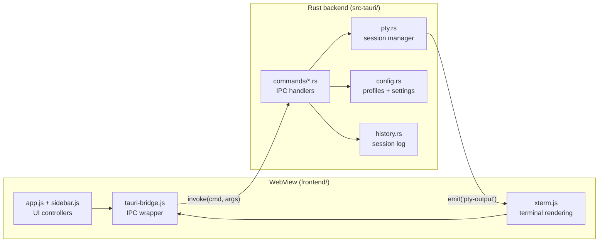

# Architecture

This document explains how Monoloth is put together so you can find your way
around quickly. For build instructions, see [CONTRIBUTING.md](CONTRIBUTING.md).

## High-level view

Monoloth is a [Tauri 2](https://tauri.app/) app: a Rust backend hosting a
system WebView that renders a vanilla-JavaScript frontend. The two halves talk
over Tauri's IPC bridge.

Two paths cross the bridge. The frontend calls backend commands with
`invoke()`, and the backend streams terminal output back to the frontend by
emitting `pty-output` events.

## Backend (`src-tauri/src/`)

`main.rs` is the entry point; it calls `lib.rs::run()`, which registers Tauri
plugins, restores window state, wires the close handler, and lists every IPC
command in `invoke_handler!`.

IPC commands live in `commands/`, one file per concern:

| File | Owns |
| --- | --- |
| `terminal.rs` | Starting, writing to, resizing, and terminating PTY sessions; resolving which executable to run |
| `shell.rs` | Background commands and launching an external terminal |
| `fs.rs` | Directory listing, file previews, drive enumeration, opening the OS file manager |
| `config.rs` | Reading and writing settings and background config |
| `profile.rs` | Creating, switching, renaming, and deleting profiles |
| `history.rs` | Querying session history |
| `image.rs` | Reading images as data URLs and analyzing wallpaper brightness |
| `window.rs` | Custom titlebar controls (minimize, maximize, close) |
| `version.rs` | App version and Windows ConPTY build info |

The core subsystems sit one level up:

- **`pty.rs`** — the terminal session manager (see below).
- **`config.rs`** — settings and profile serialization. Settings are an untyped
  `serde_json::Value` map behind a mutex. It also sanitizes window state on load
  to self-heal bogus sizes and positions.
- **`history.rs`** — records session start/end times and per-tool usage.

## The PTY subsystem

The terminal is the most interesting part. `PtyManager` (`pty.rs`) holds a map
of session IDs to live sessions and uses `portable-pty`, which selects ConPTY
on Windows and Unix PTYs elsewhere.

A session goes through three stages:

1. **Spawn.** `start_terminal` resolves which executable to run (the configured
   startup command, a custom command, or a panel shell), then `PtyManager::spawn`
   opens a PTY pair, launches the command, and starts a reader thread. Each spawn
   bumps a per-session generation counter so stale output from a replaced session
   can be discarded.
2. **Stream.** The reader thread reads bytes, handles partial UTF-8 sequences
   across reads, and emits `pty-output` events tagged with the session ID and
   generation. The frontend feeds the data into the matching xterm.js instance.
   `send_input` and `resize_terminal` write to and resize the live PTY.
3. **Teardown.** `terminate` kills the child, drops the writer, releases the
   resizer, and joins the reader thread. On window close, `lib.rs` ends history
   sessions and calls `terminate_all`.

The app runs a main session plus a secondary CMD panel (`session_id = "panel"`,
toggled with `Ctrl+J`) and additional `panel-tab-*` sessions for panel tabs.

## The IPC contract

`tauri-bridge.js` is the single place the frontend touches the backend. It wraps
`window.__TAURI__.core.invoke` and exposes a typed-ish `window.monolithApi`
object. Two wrappers shape the responses:

- `callApi(cmd, args, transform)` returns `{ success: true, ...transform(result) }`
  on success or `{ success: false, error }` on failure.
- `callApiValue(cmd, args, fallback)` returns the raw result, or the fallback on
  error.

Because of this wrapping, bridge responses are not the bare backend return
value. For example, `analyze_image_brightness` resolves to
`{ success: true, brightness: <number> }`, not a bare number. Check the bridge
method before reading a response field.

## Frontend (`frontend/`)

`index.html` loads scripts in a load-bearing order: xterm libraries, then
`tauri-bridge.js` (sets `window.monolithApi`), then `dom-utils.js` (sets
`window.MonolothUI`), the updater/process plugin wrappers, `tooltip.js`,
`app.js`, and finally `sidebar.js`. Each tag carries a `?v=N` cache buster
because WebView2 caches aggressively; bump them when you change a file.

- **`app.js`** — the main controller: terminal lifecycle, settings, command
  palette, theme and background, window chrome.
- **`sidebar.js`** — the sidebar and the CMD panel tab manager.
- **`tauri-bridge.js`** — the IPC layer described above.
- **`lib/dom-utils.js`** — shared UI helpers (modals, focus trapping, platform
  detection) on `window.MonolothUI`.
- **`lib/`** — vendored xterm, plus IIFE wrappers for the updater and process
  plugins.

## Data and config locations

State lives under `%APPDATA%/Monoloth/` on Windows (and the platform config
directory elsewhere):

- `config.json` — global settings and the active profile.
- `profiles/*.json` — per-profile overrides. Keys not in the global set are
  profile-overridable.

## Key design decisions

- **No bundler, no `package.json`.** The frontend is small enough that a build
  step adds more friction than value. Assets are served straight from
  `frontend/`, so a change is a refresh away.
- **Vanilla JavaScript.** No framework keeps the dependency surface tiny and the
  mental model direct. The tradeoff is manual DOM work and the script load order
  above.
- **Untyped config map.** Settings are a `serde_json::Value` map rather than a
  rigid struct, so adding a setting needs no backend schema change. The frontend
  and `defaults()` define the real shape.
- **`portable-pty` over a custom PTY layer.** It gives one terminal API across
  ConPTY and Unix PTYs, which is what made cross-platform support tractable.
