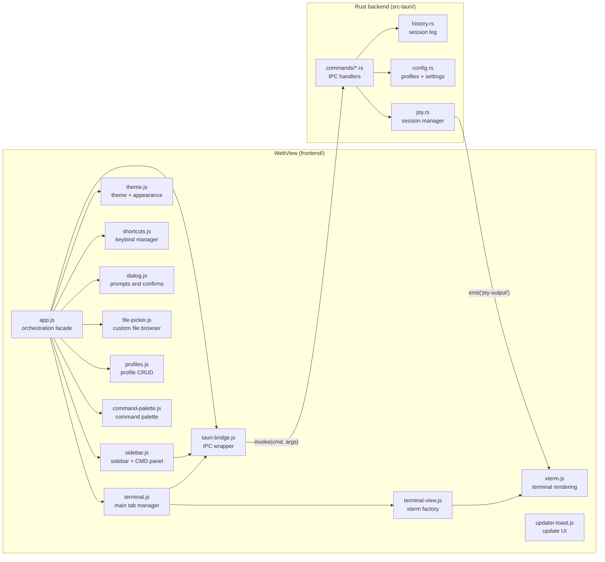

# Architecture

This document explains how Monoloth is put together so you can find your way
around quickly. For build instructions, see [CONTRIBUTING.md](CONTRIBUTING.md).

## High-level view

Monoloth is a [Tauri 2](https://tauri.app/) app: a Rust backend hosting a
system WebView that renders a vanilla-JavaScript frontend. The two halves talk
over Tauri's IPC bridge.

Two paths cross the bridge. The frontend calls backend commands with
`invoke()`, and the backend streams terminal output back to the frontend by
emitting `pty-output` events.

## Backend (`src-tauri/src/`)

`main.rs` is the entry point; it calls `lib.rs::run()`, which registers Tauri
plugins, restores window state, wires the close handler, and lists every IPC
command in `generate_handler![]`. The close handler ends all history sessions
(main, panel, all tabs) and terminates every PTY.

IPC commands live in `commands/`, one file per concern:

| File | Owns |
| --- | --- |
| `terminal.rs` | Starting, writing to, resizing, and terminating PTY sessions; resolving which executable to run; secondary commands (before/parallel/hidden) |
| `shell.rs` | Background commands and launching an external terminal |
| `fs.rs` | Directory listing, file previews, drive enumeration, native file/folder pickers, opening the OS file manager |
| `config.rs` | Reading and writing settings, background config, and batch config writes |
| `profile.rs` | Creating, switching, renaming, and deleting profiles |
| `history.rs` | Querying session history |
| `image.rs` | Reading images as data URLs and analyzing wallpaper brightness |
| `window.rs` | Custom titlebar controls (minimize, maximize, close) |
| `version.rs` | App version and Windows ConPTY build info |
| `mod.rs` | Shared path/shell utilities (`expand_env_vars`, `parse_path`, `shell_command`) |

Two update-related commands live directly in `lib.rs`:
`start_update_download` (checks for updates, downloads with progress via
channels, supports cancellation) and `cancel_update_download`.

The core subsystems sit one level up:

- **`pty.rs`** — the terminal session manager (see below).
- **`config.rs`** — settings and profile serialization. Settings are an untyped
  `serde_json::Value` map behind an `Arc<Mutex<ConfigInner>>`. It self-heals
  window state on load (bad sizes, Windows minimized sentinel `-32000`) and
  writes config files atomically via tempfile-and-rename.
- **`history.rs`** — records session start/end times, profile, command, and
  directory for every session. Supports per-session IDs, retention pruning,
  and bulk operations on main tabs and panel tabs.

## The PTY subsystem

The terminal is the most interesting part. `PtyManager` (`pty.rs`) holds a map
of session IDs to live sessions and uses `portable-pty`, which selects ConPTY
on Windows and Unix PTYs elsewhere.

### Session types

| Prefix | Created by | Purpose |
| --- | --- | --- |
| `main-*` | `start_terminal` | Main terminal tab sessions |
| `panel-*` | `start_terminal` | CMD panel sessions (original `panel`, plus `panel-tab-*`) |
| `hidden-*` | `start_terminal` | Headless background PTY sessions from secondary commands |

### Lifecycle

1. **Spawn.** `start_terminal` resolves which executable to run (startup
   preset, custom command, or panel shell), optionally runs synchronous
   "before" commands, spawns the PTY, then launches "parallel" commands in
   separate windows and "hidden" commands as headless PTY sessions. Each spawn
   bumps a per-session generation counter so stale output from a replaced
   session can be discarded.
2. **Stream.** The reader thread reads bytes in an 8 KB buffer, handles
   partial UTF-8 sequences across reads (buffering incomplete code points,
   replacing invalid bytes with `�`), and emits `pty-output` events tagged
   with the session ID and generation. The frontend routes the data to the
   matching xterm.js instance. `send_input` and `resize_terminal` write to and
   resize the live PTY.
3. **Teardown.** `terminate` kills the child, drops the writer, releases the
   resizer, and joins the reader thread. `retire_session` additionally clears
   the generation counter. Group operations (`terminate_by_prefix`,
   `retire_panel_tab`, `retire_panel_tabs_for_main_tab`) handle bulk cleanup.

On window close, `lib.rs` calls `session_end_all_main_tabs()`,
`session_end_all_panel_tabs()`, `session_end()`, and `terminate_all()`.

## Multi-tab architecture

The frontend manages two independent tab systems, both with PTY sessions:

- **Main tabs** (`terminal.js`) — one xterm instance per tab, each with its
  own PTY (`main-0`, `main-1`, …), directory, and profile. Tabs can be
  reordered, renamed, and closed. Persistence is opt-in via `persistMainTabs`.
- **Panel tabs** (`sidebar.js`) — the bottom CMD panel, toggled with
  `Ctrl+J`. Tab groups are scoped per main tab: switching main tabs
  reveals the panel tabs associated with that main tab. Panel tabs use
  `panel` / `panel-tab-*` session IDs.

Both systems share xterm instance creation through `terminal-view.js`, which
provides a factory that wires up the WebGL addon, FitAddon, platform-specific
options (Windows ConPTY info, macOS option-as-meta), and resize handlers.

## The IPC contract

`tauri-bridge.js` is the single place the frontend touches the backend. It wraps
`window.__TAURI__.core.invoke` and exposes a typed-ish `window.monolithApi`
object. Two wrappers shape the responses:

- `callApi(cmd, args, transform)` returns `{ success: true, ...transform(result) }`
  on success or `{ success: false, error }` on failure.
- `callApiValue(cmd, args, fallback)` returns the raw result, or the fallback on
  error.

Because of this wrapping, bridge responses are not the bare backend return
value. For example, `analyze_image_brightness` resolves to
`{ success: true, brightness: <number> }`, not a bare number. Check the bridge
method before reading a response field.

## Frontend (`frontend/`)

`index.html` loads scripts in a load-bearing order. Each tag carries a `?v=N`
cache buster because WebView2 caches aggressively; bump them when you change
a file.

### Module system

Each IIFE module (loaded before `app.js`) exposes ONE `window.Monolith*`
or `window.Monoloth*` global. Modules communicate only through these globals
and event handlers — there are no imports.

| File | Global | Purpose |
| --- | --- | --- |
| `tauri-bridge.js` | `window.monolithApi` | IPC bridge — all backend calls go through here |
| `lib/dom-utils.js` | `window.MonolothUI` | Modal focus trapping, escape-html, debounce, platform detection |
| `lib/plugin-updater.js` | `window.__TAURI_PLUGIN_UPDATER__` | Tauri updater plugin wrapper |
| `lib/plugin-process.js` | `window.__TAURI_PLUGIN_PROCESS__` | Tauri process plugin wrapper |
| `lib/updater-toast.js` | `window.MonolothUpdater` | In-app update notification UI (toast, pill, progress) |
| `tooltip.js` | `window.MonolothTooltip` | Custom tooltip positioning and lifecycle |
| `shortcuts.js` | `window.MonolithShortcuts` | Parse, match, load, save, and rebind keyboard shortcuts |
| `theme.js` | `window.MonolithTheme` | Theme mode, CTA style, wallpaper brightness analysis, xterm palettes |
| `dialog.js` | `window.MonolithDialog` | Promise-based prompt and confirm dialogs with "don't ask again" persistence |
| `file-picker.js` | `window.MonolithFilePicker` | Custom file browser with breadcrumbs, sidebar, image previews, and keyboard nav |
| `command-palette.js` | `window.MonolithPalette` | Command palette overlay with grouped actions and sub-palettes |
| `profiles.js` | `window.MonolithProfiles` | Profile CRUD, switcher modal, per-tab profile assignment |
| `lib/terminal-view.js` | `window.MonolithTerminalView` | xterm.js instance factory (WebGL, FitAddon, resize, key handling) |
| `terminal.js` | `window.MonolithTerminal` | Main terminal tab manager, PTY output routing, new tab card |
| `app.js` | `window.MonolothApp` | Central orchestration — settings, background, launcher, startup config, history, recent dirs |
| `sidebar.js` | `window.SidebarManager` | Sidebar buttons, CMD panel, panel tab manager, resize handle |

`app.js` loads last and acts as the facade. Other modules may reference
`window.MonolothApp.*` or another module's global only inside event-time
handlers, never at IIFE top level.

Key external contracts:
- The backend calls `window.writeToTerm(data, eof, sessionId, generation)` to
  route PTY output.
- `sidebar.js` calls `window.__monolithTermWinOpts()` for ConPTY build info.
- The shared `keydown` handler in `app.js` delegates to `MonolithPalette`,
  `MonolithDialog`, and `MonolithProfiles` via their `is*Active()` + action
  methods.

### Hide-until-ready

Content is hidden (`visibility: hidden`) until the bridge is ready and fonts
are loaded. `app.js` waits up to 5 seconds for the bridge, then triggers
`window.__monolithReveal()`. A 1500 ms font-ready fallback runs in
`index.html`.

## Data and config locations

State lives under `%APPDATA%/Monoloth/` on Windows (and the platform config
directory elsewhere):

- `config.json` — global settings and the active profile.
- `profiles/*.json` — per-profile overrides. Keys not in the `GLOBAL_KEYS`
  set (window state, sidebar config, tab bar position, etc.) are
  profile-overridable. Switching profiles deep-merges the chosen profile's
  overrides onto the global base.

## Updater system

The updater has two halves:

1. **Backend** (`lib.rs`) — `start_update_download` checks for updates via the
   Tauri updater plugin, downloads/installs with progress events streamed over
   a `Channel<DownloadEvent>`, and supports cancellation via
   `CancelDownloadState`. The updater endpoint is the cross-platform
   `latest.json` assembled by the `finalize-updater` CI job.
2. **Frontend** (`updater-toast.js`) — renders a toast notification with a
   download progress bar (determinate/indeterminate), handles errors
   (signature, network, rate limit, permission, in-use), supports retry/cancel,
   and switches to a compact mini-pill during downloads. Auto-checks on launch.

## Key design decisions

- **No bundler, no `package.json`.** The frontend is small enough that a build
  step adds more friction than value. Assets are served straight from
  `frontend/`, so a change is a refresh away.
- **Vanilla JavaScript.** No framework keeps the dependency surface tiny and the
  mental model direct. The tradeoff is manual DOM work and the load-bearing
  script order.
- **Untyped config map.** Settings are a `serde_json::Value` map rather than a
  rigid struct, so adding a setting needs no backend schema change. The frontend
  and `defaults()` define the real shape.
- **`portable-pty` over a custom PTY layer.** It gives one terminal API across
  ConPTY and Unix PTYs, which is what made cross-platform support tractable.
- **Generation counters.** Each PTY spawn bumps a counter passed with every
  `pty-output` event. If a session is killed and replaced, stale output from
  the old session is discarded by the frontend rather than corrupting the display.
