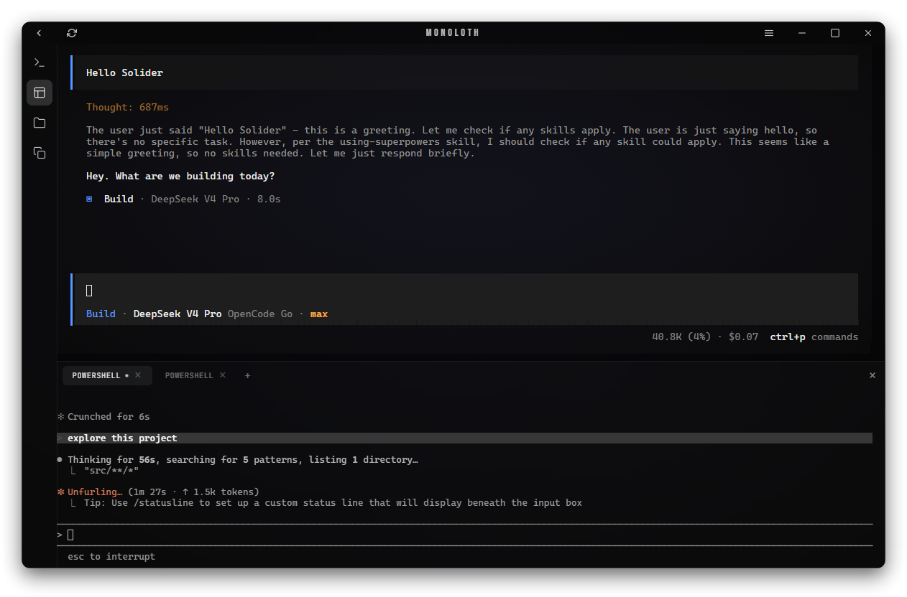
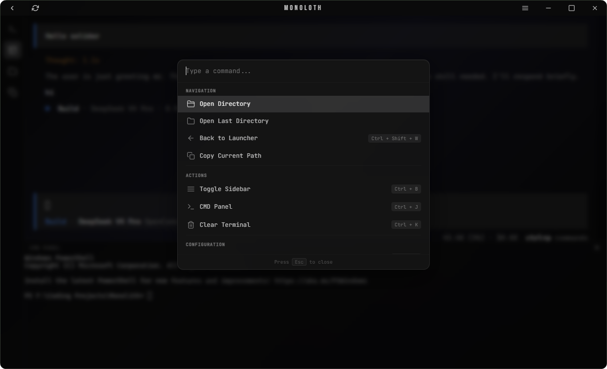
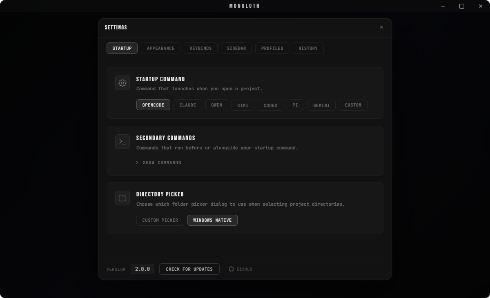
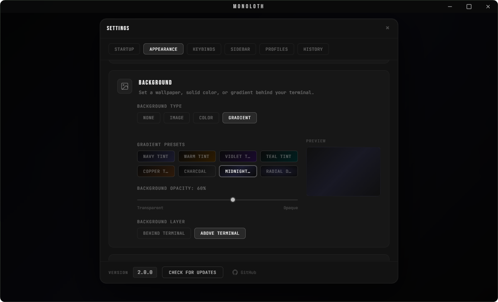
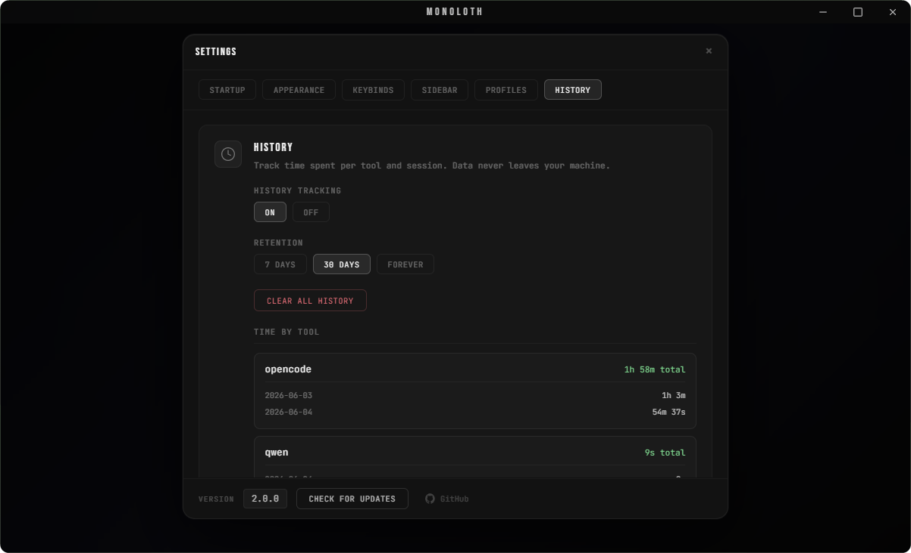
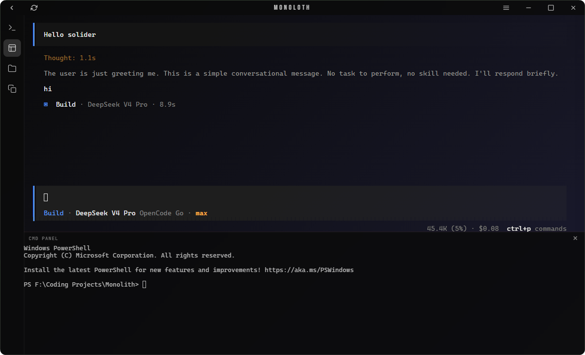
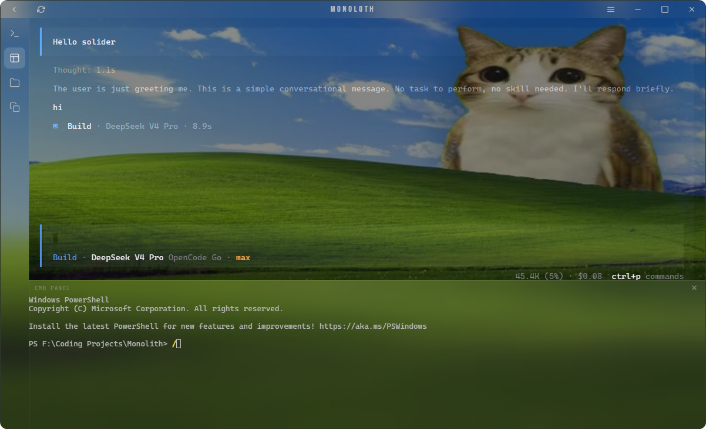

<div align="center">
  
<div id="toc">
  <ul style="list-style: none">
    <summary>
      <h1>Monoloth</h1>
    </summary>
  </ul>
</div>

  <p><strong>Agent-agnostic desktop shell for CLI coding tools</strong></p>

  <p>
    
    
    
    
    
  </p>
</div>

[](https://github.com/noahain/Monoloth)

---

Monoloth wraps CLI coding agents (like OpenCode and Claude Code) in a native Windows desktop shell. Choose a project directory to start a session with integrated terminal emulation and session history tracking.

We built the backend with Tauri 2 and Rust, and the frontend with vanilla JavaScript. The project does not use a bundler, a `package.json` file, or a Node.js build process.

### Build & Run

Ensure you have the Rust toolchain installed, then compile the application.

```bash
# Clone the repository
git clone https://github.com/noahain/Monoloth.git
cd Monoloth

# Verify the setup
cd src-tauri
cargo check

# Run in development mode
cargo tauri dev

# Build the release executable
cargo tauri build
```

The system serves frontend assets directly from the `frontend/` directory, requiring no package manager.

### Features

- **Terminal emulator**
  - Uses xterm.js with WebGL rendering
  - Manages multiple session PTYs via `portable-pty`
  - Includes a secondary CMD panel with drag-to-resize handles
- **Command palette** (`Ctrl+P`)
  - Provides grouped commands and directory navigation
  - Allows users to trigger custom secondary actions
- **Custom sidebar**
  - Supports background commands and external terminal execution
  - Offers reorderable buttons and multiple icon options
- **Visual theme configuration**
  - Updates color themes based on wallpaper brightness
  - Applies blur or solid styling to UI elements
- **Profile system**
  - Keeps user settings separate while sharing global window states
- **Session tracking**
  - Saves session times and per-tool usage breakdowns

### Visual Gallery

<div style="display: flex; justify-content: space-between; width: 100%; gap: 20px; margin-bottom: 24px;">
  
  
</div>

<div style="display: flex; justify-content: space-between; width: 100%; gap: 20px;">
  
  
</div>


### Customization Presets

<div style="display: flex; justify-content: space-between; width: 100%; gap: 20px;">
  
  
</div>


### Prerequisites

- **Windows 10 or newer** (WebView2 bundles via the `embedBootstrapper` configuration)
- **Rust toolchain** 1.77.2 or newer
- **Build Tools**: [C++ Build Tools](https://learn.microsoft.com/en-us/cpp/build/vscpp-step-0-installation)

### Project Structure

<details>
<summary><b>View Directory Layout</b></summary>

```
Monoloth/
├── src-tauri/                  # Rust backend configuration
│   ├── src/
│   │   ├── main.rs             # Execution entry point
│   │   ├── lib.rs              # Tauri setup and window events
│   │   ├── commands/           # Tauri IPC commands
│   │   │   ├── config.rs       # Profile and background configurations
│   │   │   ├── fs.rs           # File operations and previews
│   │   │   ├── history.rs      # Session history queries
│   │   │   ├── image.rs        # Image reading and analysis
│   │   │   ├── profile.rs      # Profile operations
│   │   │   ├── shell.rs        # External execution handling
│   │   │   ├── terminal.rs     # Terminal session management
│   │   │   └── window.rs       # Window controls
│   │   ├── config.rs           # Profile serialization and sanitization
│   │   ├── history.rs          # History tracking
│   │   └── pty.rs              # Terminal manager interface
│   ├── Cargo.toml
│   └── tauri.conf.json
├── frontend/
│   ├── index.html              # HTML structure
│   ├── app.js                  # Main application controller
│   ├── sidebar.js              # Sidebar logic
│   ├── tauri-bridge.js         # IPC layer
│   ├── dom-utils.js            # User interface utilities
│   ├── tooltip.js              # Custom tooltips
│   ├── style.css               # Application stylesheet
│   └── lib/
│       ├── xterm.js            # Terminal rendering library
│       ├── xterm-addon-fit.js  # Terminal fit plugin
│       ├── xterm-addon-webgl.js# Terminal WebGL acceleration
│       ├── plugin-updater.js   # Updater wrapper
│       ├── plugin-process.js   # Process wrapper
│       └── updater-toast.js    # Update notifications
├── assets/
│   ├── icon.png
│   ├── icon.ico
│   └── screenshots/
└── .github/workflows/release.yml
```
</details>

### Configuration

The application stores settings at `%APPDATA%/Monoloth/config.json` and saves user profiles in `%APPDATA%/Monoloth/profiles/`.

| Parameter | Default Value | Description |
| --------- | ------------- | ----------- |
| `startup_command` | `opencode` | Default CLI command |
| `theme_mode` | `dark` | Default theme configuration |
| `bg_type` | `none` | Background image type |
| `cta_button_style` | `blur` | Visual theme styling |
| `active_profile` | `Default` | Loaded settings profile |
| `use_custom_titlebar` | `true` | Frame display configuration |

#### Settings Tabs

- **Startup**: Configures startup commands and default directories.
- **Appearance**: Controls visual themes and background styles.
- **Keybinds**: Rebinds command palette shortcuts.
- **Profiles**: Manages active user profiles.
- **History**: Controls session retention rules.
- **Sidebar**: Reorders sidebar buttons and action layouts.

### Tech Stack

Rust 1.77.2 • Tauri 2.11.1 • portable-pty • xterm.js • WebGL • Vanilla JS • HTML5 • CSS3

### License
MIT
