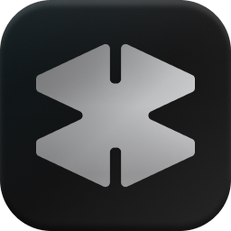

<div align="center">
  
  <h1>Monolith</h1>

  <p><strong>Brutalist desktop launcher for OpenCode</strong></p>

  <p>
    
    
    
    
  </p>
</div>

---

Monolith wraps OpenCode in a native window. Pick a project directory, and it launches your session. No terminal, no `cd`, no friction.

## What it does

**Project launcher**
- Select a directory via native file picker
- Jumps directly into OpenCode
- Remembers recent workspaces

**Settings panel (three tabs)**

| Tab | Function |
| :--- | :--- |
| **Setup** | Deploys config files to `~/.config/opencode/`, manages 21st.dev API keys, includes optional preset configurations |
| **Config** | Live JSON editor for `opencode.json` with save and hot-reload |
| **Updater** | Checks for app updates and pulls latest configs from GitHub |

**Interface**
- Pure black (`#000000`) background
- Condensed all-caps typography
- No decorative elements

**Performance**
- Built with PyWebView
- Minimal RAM footprint

## Install

**Requirements**
- [Python 3.12+](https://www.python.org/)
- [OpenCode](https://github.com/anomalyco/opencode)

```bash
git clone https://github.com/noahain/monolith
cd monolith
pip install -r requirements.txt
python main.py
```

## Tech stack

Python 3.12 · PyWebView · HTML5/CSS3/Vanilla JS

## Development team

- **Lead:** Noahain - product vision, design language
- **Primary developer:** OpenCode (Kimi K2.6) - TUI wrapping logic, directory orchestration, config bridge
- **Technical consultant:** DeepSeek V4 Pro - filesystem handlers, UI responsiveness

## License

MIT

